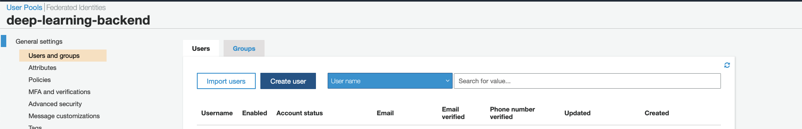
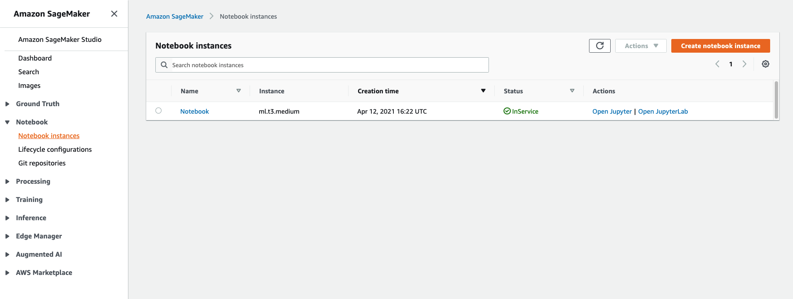

# dnn-web-app-blog
This repo contains files for the following AWS blog: "Creating an end-to-end application for orchestrating custom deep learning HPO, training, and inference using AWS Step Functions"

** This project has been archived. The code still works but we do not update the libraries to fix new vulnerabilities. If you want to modify it for production usage, please upgrade the libraries to newver versions.**

# Prerequisites
1. Docker (tested on Docker Desktop version 3.2.2). This is required for SAM and building custom image. We also recommend that you create an account in docker and log into it when installing this app, to avoid limit restrictions.
2. SAM CLI The installation steps are in [this link](https://docs.aws.amazon.com/serverless-application-model/latest/developerguide/serverless-sam-cli-install.html). 
    * If you have never used SAM before, it is recommended to go through "Tutorial: Deploying a Hello World Application" section. It should take about 10 minutes to finish. 
3. Python 3.7 (tested with version 3.7.6)
4. NodeJS 10.x or 12.x (tested with version 10.20.1 and 12.14.1)
5. Have access to Public ECR (by running `aws ecr-public get-login-password --region us-east-1 | docker login --username AWS --password-stdin public.ecr.aws` , see details [here](https://docs.aws.amazon.com/AmazonECR/latest/public/public-registries.html#public-registry-auth))

# Deployment steps

1. Clone this repo to your computer.

1. Verify that you have:
    * Docker running (Can run `docker ps` successfully)
    * Set up AWS Profile (Can run `aws sts get-caller-identity` successfully)
    * Installed SAM CLI (Can run `sam --version` successfully)

1. Open ```install.sh``` file in the main directory and update "Your Email Address" and "Customer Name" with correct information. Please make sure you provide a valid email address because username and password will be emailed to that address.

1. Open a terminal and cd to the main directory (where ```install.sh``` is located) and then run the following command: ```./install.sh```

1. Installation will take several minutes to complete. If installation is successfull, CloudFront URL will be printed in the end at the terminal. Copy that URL to an internet browser. Check the email address that you provided earlier. You should receive an email with a username and password. You can log in to the application with those credentials.

1. If you do not receive the username and password, you can create a new one by yourself at [AWS Cognito Console](https://console.aws.amazon.com/cognito/users)
    * Click on the userpool with your application name (default to `deep-learning-backend`)
    * Click Users and groups
    * Click "Create User" button

      

# Changing your model

The `./install.sh` script will also create a Sagemaker notebook instance with the name "Notebook". You can access it in [SageMaker AWS console](https://console.aws.amazon.com/sagemaker/home), in Notebook ▸ Notebook instances.

  

 You should see the content of this repo already copied there. Notebooks for local building and testing the docker container can be found in the following directory: ‎⁨deep-learning-web-app⁩ ▸ ⁨machine-learning⁩  ▸ test_on_notebook. For more info, refer to the Appendix section in the blog.

# Overview of components

This application consists of 4 main components, separated into 4 folders and deployed as separated stacks:
1. `machine-learning` - contains SageMaker notebook and scripts for building ML Docker Image (for both HPO and training a new model)
2. `shared-infra` - contains AWS resources used by both `backend` and `frontend` in CloudFormation template.
3. `backend` - contains backend code, APIs, a pipeline for retraining model and running HPO, and database (DynamoDB) 
4. `frontend` - contains web application code. The web application connected to the deployment of `backend` folder
